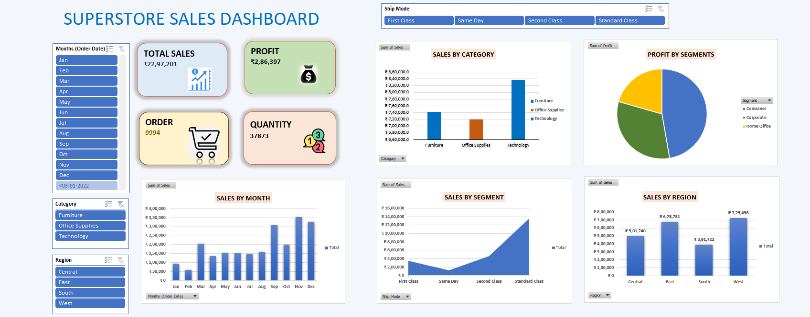

# 📊 Advanced Sales Analytics Dashboard — Excel

## 📌 Project Overview

The **Advanced Sales Analytics Dashboard** is an interactive Excel dashboard designed to analyze sales performance and provide clear business insights through KPIs, charts, Pivot Tables, and interactive slicers.

The project transforms raw sales data into an easy-to-understand dashboard that helps users monitor revenue, sales trends, product performance, and other important business metrics.

---

## 🎯 Project Objectives

* Analyze overall sales performance
* Track important sales KPIs
* Identify top-performing products
* Analyze sales trends over time
* Compare sales performance across different categories
* Create an interactive and user-friendly dashboard
* Generate insights to support data-driven decision-making

---

## 🛠️ Tools & Excel Features Used

| Tool / Feature      | Purpose                                 |
| ------------------- | --------------------------------------- |
| **Microsoft Excel** | Data analysis and dashboard development |
| **Pivot Tables**    | Data summarization and analysis         |
| **Pivot Charts**    | Interactive data visualization          |
| **Slicers**         | Interactive filtering                   |
| **KPI Cards**       | Display key business metrics            |
| **Excel Formulas**  | Calculations and analysis               |
| **Data Cleaning**   | Preparing raw data for analysis         |

---

## 📊 Dashboard Features

### 💰 Sales Performance

* Total Sales
* Total Orders
* Average Sales
* Sales trends
* Revenue performance

### 📦 Product Analysis

* Top-performing products
* Product-wise sales
* Category-wise performance

### 📅 Time-Based Analysis

* Monthly sales trends
* Yearly performance
* Period-wise comparison

### 🎛️ Interactive Filters

The dashboard uses **Excel Slicers** to allow users to dynamically filter and explore the data based on available dimensions such as:

* Product
* Category
* Region
* Date/Year
* Other relevant business fields

---

## 📈 Dashboard Visualizations

The dashboard includes:

* 📊 Bar Charts
* 📈 Line Charts
* 🍩 Doughnut Charts
* 🎯 KPI Cards
* 📋 Pivot Tables
* 🎛️ Interactive Slicers

These visualizations make it easier to identify sales patterns and compare business performance.

---

## 🔄 Data Analysis Workflow

```text
Raw Sales Data
      ↓
Data Cleaning
      ↓
Data Preparation
      ↓
Pivot Tables
      ↓
KPI Calculations
      ↓
Pivot Charts
      ↓
Slicers & Filters
      ↓
Interactive Excel Dashboard
      ↓
Business Insights
```

---

## 💡 Key Business Insights

The dashboard helps identify:

* Overall sales performance
* Best-performing products
* Strong and weak sales periods
* Category-wise sales performance
* Sales trends over time
* Areas with opportunities for improvement

---

## 📸 Dashboard Preview





## 📁 Project Structure

```text
Advanced-Sales-Analytics-Excel/
│
├── README.md
│
├── Dataset/
│   └── sales_data.xlsx
│
├── Dashboard/
│   └── Advanced_Sales_Dashboard.xlsx
│
└── Images/
    └── sales-dashboard.png
```

---

## 🚀 Project Outcome

This project demonstrates practical experience in **Excel-based data analysis and dashboard development**.

### Skills Demonstrated

**Advanced Excel | Data Cleaning | Pivot Tables | Pivot Charts | Slicers | KPI Reporting | Data Visualization | Sales Analysis | Dashboard Development | Business Insights**

---

## 👨‍💻 Author

**Sudharsan**

Aspiring Data Analyst | SQL | Power BI | Excel | Python

---

⭐ Feel free to explore the project and dashboard.


